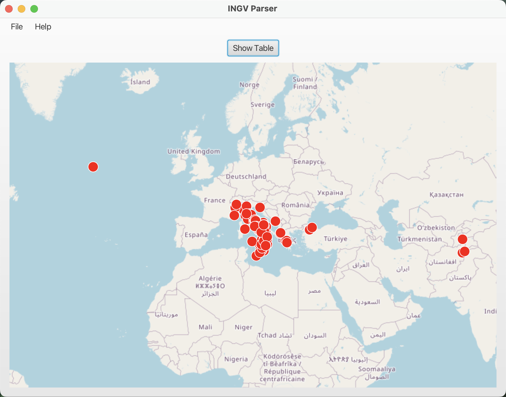

# **INGV-FX parser** 🌎🫨

**INGV-FX Parser** è un’applicazione desktop JavaFX che consente di visualizzare in modo interattivo i **dati sismici** forniti dall’INGV *(Istituto Nazionale di Geofisica e Vulcanologia)*.
L’app effettua il fetch dei dati da un  di rete e li mostra sia in una tabella dettagliata sia su una mappa geografica interattiva.

## **📼 Caratteristiche Principali**

- **Visualizzazione** dei terremoti in tabella con data, magnitudo e località.
- **Filtri** per data e limite di risultati.
- **Ricerca** testuale tra gli eventi.
- Visualizzazione geografica dei terremoti tramite marker su **mappa interattiva**.

## **⚒️ Dettagli**

L'applicazione é realizzata interamente in  ed utilizza la seguente , fornita dall'INGV, per il fetch dei risultati.

Il progetto é stato testato su processore armV8 (M1) () con building mediante . É stata utilizzata la **JDK 24** fornita da , build 24+36-3646.
