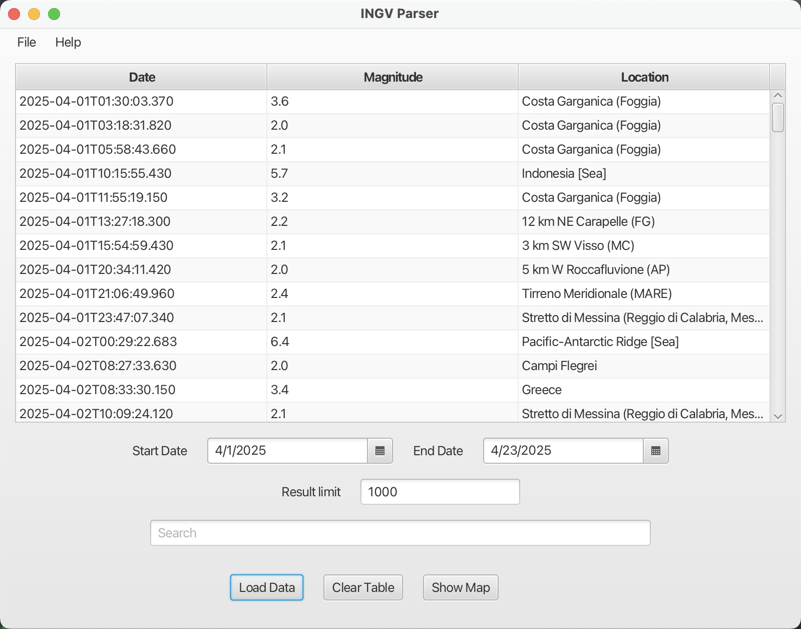

# **INGV-FX parser** 🌎🫨
**INGV-FX Parser** is a JavaFX desktop application that allows interactive visualization of **seismic data** provided by INGV *(Istituto Nazionale di Geofisica e Vulcanologia)*.
The app fetches data from a [network endpoint](https://webservices.ingv.it/swagger-ui/dist/?url=https://ingv.github.io/openapi/fdsnws/event/0.0.1/event.yaml) and displays them both in a detailed table and on an interactive geographic map.

## **📼 Main Features**

- **Visualization** of earthquakes in a table with date, magnitude, and location.
- **Filters** by date and result limit.
- **Text search** among events.
- Geographic visualization of earthquakes using markers on an **interactive map**.

## **⚒️ Details**

The application is entirely developed in  and uses the following , provided by INGV, to fetch the results.

The project has been tested on an armV8 (M1) processor () with build management via . **JDK 24** provided by , build 24+36-3646, was used.

